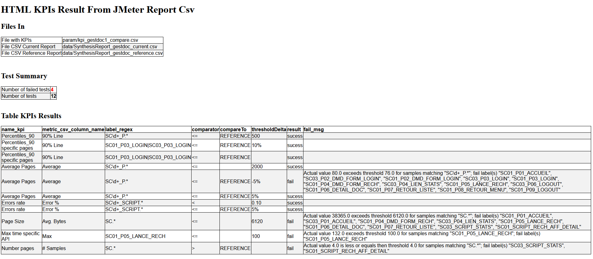

# Compare 2 load tests JMeter Report CSV File and create a JUnit Report based on custom Key Performance Indicators (KPIs)

This tool read KPI declarations in a file and apply the KPI assertion on 2 JMeter Report CSV files (current and reference) and generates a result file in JUnit XML format and others formats Html, Json and Csv.

JMeter Report CSV file is created with Listener : 
- Summary Report, documentation at [Summary Report](https://jmeter.apache.org/usermanual/component_reference.html#Summary_Report)
- Aggregate Report, documentation at [Aggregate Report](https://jmeter.apache.org/usermanual/component_reference.html#Aggregate_Report)
- Synthesis Report, documentation at [Synthesis Report](https://jmeter-plugins.org/wiki/SynthesisReport/)

and "Save Table Data" button<br>


JMeter Report CSV could be generated in Command Line Interface (CLI) with :
- JMeterPluginsCMD tool, documentation at [JMeterPluginsCMD](https://jmeter-plugins.org/wiki/JMeterPluginsCMD/)
  - E.g : JMeterPluginsCMD.bat --generate-csv aggregate.csv --input-jtl results.csv --plugin-type AggregateReport
  - JMeterPluginsCMD.bat --generate-csv synthesis.csv --input-jtl results.csv --plugin-type SynthesisReport
- jmeter-graph-tool-maven-plugin maven plugin, documentation at [jmeter-graph-tool-maven-plugin](https://github.com/vdaburon/jmeter-graph-tool-maven-plugin)

Example of a JMeter Report CSV file (Synthesis Report) <br>
<br>
The column separator is ',' and the decimal separator is the period '.' character (usually : LANG=en_US)

The first line contains **header** column name<br>


## The KPI file format
The KPI file need 6 columns :
1) name_kpi the name of the KPI also the classname in the Test Case in JUnit
2) metric_csv_column_name the column name **header** in the JMeter Report CSV file (**header** likes : `# Samples` or `Average` or `Min` or `Max` or `90% Line` or `Std. Dev.` or `Error %` or `Throughput` or `Received KB/sec` or `Avg. Bytes` or `MY_COLUMN_NAME`)
3) label_regex the Label name in regular expression, label header in the JMeter Report CSV file (E.g : `SC01_P.*` or `SC\d+_P.*` or `SC01_P01_LOGIN` or `SC01_P01_LOGIN|SC01_P02_HOME` or `\d+ /.*` )
4) comparator the comparator `<` or `<=` or `>` or `>=`
5) compare_to `empty` (column value is empty) or `REFERENCE` 
5) threshold_delta the value
6) comment a comment to explain the kpi

If compare_to is empty, value is compared to current result threshold_delta **absolute** value (E.g : 2000 ms **absolute**), for `Error %` value between 0 and 1 (0.20 for 20%)<br>
If compare_to equals `REFERENCE`, current value not end with `%` then compare to (reference value + threshold_delta) **delta** value (E.g : **add** 500 ms (**delta**) to the reference value)<br>
If compare_to equals `REFERENCE`,current value ended with `%` then compare to (reference value + threshold_delta/100) **delta** % value (E.g : **add** 10% (**delta**) to the reference value)<br>

Examples : <br>
Percentiles_90,90% Line,SC01_P01_LOGIN,&lt;=,REFERENCE,500   : The current value column `90% Line` for Label SC01_P01_LOGIN need to be &lt;= (The reference value column `90% Line` for Label SC01_P01_LOGIN + 500 ms delta) <br>
Page Size,Avg. Bytes,SC.&#42;,&lt;=,,6120  : The current value colum `Avg. Bytes` for Labels starting with "SC" need to be &lt;= 6120 Bytes (absolute value)<br>
Errors rate,Error %,SC\d+\_SCRIPT.&#42;,&lt;=,REFERENCE,5% : The current value column `Error %` for Labels matching regex need to be &lt;= (The reference value column `Error %` for Labels matching regex * 1.05 (5% delta) )<br>

The column separator is ','  and the decimal separator is the period '.' character for the kpi file
<pre>
name_kpi,metric_csv_column_name,label_regex,comparator,compare_to,threshold_delta,comment
Percentiles_90,90% Line,SC\d+_P.*,<=,REFERENCE,500,Current <= (Reference + 500 ms)
Percentiles_90 specific pages,90% Line,SC01_P03_LOGIN|SC03_P03_LOGIN,<=,REFERENCE,10%,Current <= (Reference * 1.10)
Percentiles_90 specific pages,90% Line,SC01_P03_LOGIN|SC03_P03_LOGIN,<=,REFERENCE,,Current <= Reference
Average Pages,Average,SC\d+_P.*,<=,,2000,Current <= 2000 ms
Average Pages,Average,SC\d+_P.*,<=,REFERENCE,-5%,Current <= Reference * 0.95) Reference -5% <= Current < Reference +5%
Average Pages,Average,SC\d+_P.*,<,REFERENCE,5%,Current < (Reference * 1.05)
Errors rate,Error %,SC\d+_SCRIPT.*,<,,0.10,Current < 0.10
Errors rate,Error %,SC\d+_SCRIPT.*,<=,REFERENCE,5%,Current < (Reference + 5%)
Page Size,Avg. Bytes,SC.*,<=,,6120,Current <= 6120 Bytes
Max time specific API,Max,SC01_P05_LANCE_RECH,<=,,100,Current <= 100
Number pages,# Samples,SC.*,>,REFERENCE,,Current >= Reference
</pre>

KPI View in Excel<br>


Save in UTF-8 comma separator **no BOM** or csv with comma separator if you have only ASCII characters (no accent é,è, à ...)

## Parameters 
The tool have parameters :
<pre>
usage: io.github.vdaburon.jmeter.utils.comparekpi.JUnitReportCompareJMReportCsv -csvJMReportCurrent &lt;csvJMReportCurrent&gt;
       -csvJMReportReference &lt;csvJMReportReference&gt; [-csvLabelColumnName &lt;csvLabelColumnName&gt;] [-csvOutFile &lt;csvOutFile&gt;] [-divHtmlOutFile
       &lt;divHtmlOutFile&gt;] [-exitReturnOnFail &lt;exitReturnOnFail&gt;] [-help] [-htmlOutFile &lt;htmlOutFile&gt;] [-jsonOutFile &lt;jsonOutFile&gt;]
       [-junitFile &lt;junitFile&gt;] -kpiFile &lt;kpiFile&gt;
io.github.vdaburon.jmeter.utils.comparekpi.JUnitReportCompareJMReportCsv
 -csvJMReportCurrent &lt;csvJMReportCurrent&gt;       JMeter report current csv file (E.g : summary.csv or aggregate.csv or synthesis.csv)
 -csvJMReportReference &lt;csvJMReportReference&gt;   JMeter report reference csv file (E.g : summary_ref.csv or aggregate_ref.csv or
                                                synthesis_ref.csv)
 -csvLabelColumnName &lt;csvLabelColumnName&gt;       Label Column Name in CSV JMeter Report (Default : Label)
 -csvOutFile &lt;csvOutFile&gt;                       Csv out file result optional (E.g: result.csv)
 -divHtmlOutFile &lt;divHtmlOutFile&gt;               Div Partial Html Page out file result optional (E.g: div_result.html), to include in an
                                                another HTML Page
 -exitReturnOnFail &lt;exitReturnOnFail&gt;           if true then when kpi fail then create JUnit XML file and program return exit 1 (KO); if
                                                false (Default) then create JUnit XML File and exit 0 (OK)
 -help                                          Help and show parameters
 -htmlOutFile &lt;htmlOutFile&gt;                     Html out file result optional (E.g: result.html)
 -jsonOutFile &lt;jsonOutFile&gt;                     Json out file result optional (E.g: result.json)
 -junitFile &lt;junitFile&gt;                         junit file name out (Default : TEST-jmeter-junit-plugin-compare-jmreport.xml)
 -kpiFile &lt;kpiFile&gt;                             KPI file contains rule to check and compare to reference value (E.g : kpi_compare.csv)
E.g : java -jar junit-reporter-kpi-compare-jmeter-report-csv-&lt;version&gt;-jar-with-dependencies.jar -csvJMReportCurrent summary.csv
-csvJMReportReference summary_ref.csv -kpiFile kpi_compare.csv -exitReturnOnFail true
or more parameters : java -jar junit-reporter-kpi-compare-jmeter-report-csv-&lt;version&gt;-jar-with-dependencies.jar -csvJMReportCurrent
aggreagate.csv  -csvJMReportReference aggregate_ref.csv -csvLabelColumnName Label -kpiFile kpi_compare.csv -junitFile junit_compare.xml
-htmlOutFile result.html -divHtmlOutFile div_result.html -csvOutFile result.csv -jsonOutFile result.json -exitReturnOnFail true
</pre>

## JUnit Report XML file generated
Example JUnit XML file generated :
```xml
<?xml version="1.0" encoding="UTF-8" standalone="no"?>
<testsuite errors="0" failures="4" name="JUnit Report From Compare JMeter Report Csv" skipped="0" tests="11">
  <testcase classname="Percentiles_90" name="90% Line (SC\d+_P.*) &lt;= (500 + REFERENCE Value)"/>
  <testcase classname="Percentiles_90 specific pages" name="90% Line (SC01_P03_LOGIN|SC03_P03_LOGIN) &lt;= (10% + REFERENCE Value)"/>
  <testcase classname="Percentiles_90 specific pages" name="90% Line (SC01_P03_LOGIN|SC03_P03_LOGIN) &lt;= (REFERENCE Value)"/>
  <testcase classname="Average Pages" name="Average (SC\d+_P.*) &lt;= 2000"/>
  <testcase classname="Average Pages" name="Average (SC\d+_P.*) &lt;= (-5% + REFERENCE Value)">
    <failure message="">Actual value 80.0 exceeds threshold 76.0 for samples matching "SC\d+_P.*"; fail label(s) "SC01_P01_ACCUEIL", "SC03_P02_DMD_FORM_LOGIN", "SC01_P02_DMD_FORM_LOGIN", "SC03_P03_LOGIN", "SC01_P03_LOGIN", "SC01_P04_DMD_FORM_RECH", "SC03_P04_LIEN_STATS", "SC01_P05_LANCE_RECH", "SC03_P06_LOGOUT", "SC01_P06_DETAIL_DOC", "SC01_P07_RETOUR_LISTE", "SC01_P08_RETOUR_MENU", "SC01_P09_LOGOUT"</failure>
  </testcase>
  <testcase classname="Average Pages" name="Average (SC\d+_P.*) &lt;= (5% + REFERENCE Value)"/>
  <testcase classname="Errors rate" name="Error % (SC\d+_SCRIPT.*) &lt; 0.10"/>
  <testcase classname="Errors rate" name="Error % (SC\d+_SCRIPT.*) &lt;= (5% + REFERENCE Value)"/>
  <testcase classname="Page Size" name="Avg. Bytes (SC.*) &lt;= 6120">
    <failure message="">Actual value 38365.0 exceeds threshold 6120.0 for samples matching "SC.*"; fail label(s) "SC01_P01_ACCUEIL", "SC03_P01_ACCUEIL", "SC01_P04_DMD_FORM_RECH", "SC03_P04_LIEN_STATS", "SC01_P05_LANCE_RECH", "SC01_P06_DETAIL_DOC", "SC01_P07_RETOUR_LISTE", "SC03_SCRIPT_STATS", "SC01_SCRIPT_RECH_AFF_DETAIL"</failure>
  </testcase>
  <testcase classname="Max time specific API" name="Max (SC01_P05_LANCE_RECH) &lt;= 100">
    <failure message="">Actual value 132.0 exceeds threshold 100.0 for samples matching "SC01_P05_LANCE_RECH"; fail label(s) "SC01_P05_LANCE_RECH"</failure>
  </testcase>
  <testcase classname="Number pages" name="# Samples (SC.*) &gt; (REFERENCE Value)">
    <failure message="">Actual value 4.0 is less or equals then threshold 4.0 for samples matching "SC.*"; fail label(s) "SC03_SCRIPT_STATS", "SC01_SCRIPT_RECH_AFF_DETAIL"</failure>
  </testcase>
</testsuite>
```
Remark : failure message is limited to 1024 characters, if failure message finished with "..." then the message is voluntarily truncated.

## JUnit Report in a Gitlab Pipeline
A JUnit Report with KPIs display in a Gitlab Pipeline<br>


If you click on button "View Details" for Status Fail, you will show the fail message<br>


## JUnit Report in Jenkins Build
A JUnit Report with KPIs display in Jenkins Build<br>


If you click on link "Name Test" fail , you will show the fail message<br>


## Html out format
The result could be a html page ou partial html page (div)<br>


## Csv out format
The result in a csv file<br>


## Json out format
The result in a Json file<br>


## License
See the LICENSE file Apache 2 [https://www.apache.org/licenses/LICENSE-2.0](https://www.apache.org/licenses/LICENSE-2.0)

## Usage Maven
The maven groupId, artifactId and version, this plugin is in the **Maven Central Repository** [](https://maven-badges.herokuapp.com/maven-central/io.github.vdaburon/junit-reporter-kpi-compare-jmeter-report-csv)

```xml
<groupId>io.github.vdaburon</groupId>
<artifactId>junit-reporter-kpi-compare-jmeter-report-csv</artifactId>
<version>1.3</version>
```
Just include the plugin in your `pom.xml` and execute `mvn verify` <br>
or individual launch `mvn -jmeterReportCurrent=synthesis.csv -DjmeterReportReference=synthesis_ref.csv -DkpiFile=kpi.csv -DjunitFile=TEST-jmeter-junit-plugin-compare-jmreport.xml exec:java@create_junit-reporter-kpi-compare-jmeter-report`

```xml

<project>
    <properties>
        <jmeterReportCurrent>synthesis.csv</jmeterReportCurrent>
        <jmeterReportReference>synthesis_ref.csv</jmeterReportReference> 
        <kpiFile>kpi.csv</kpiFile>
        <junitFile>TEST-jmeter-junit-plugin-compare-jmreport.xml</junitFile>
    </properties>

    <dependencies>
        <dependency>
            <groupId>io.github.vdaburon</groupId>
            <artifactId>junit-reporter-kpi-compare-jmeter-report-csv</artifactId>
            <version>1.3</version>
        </dependency>
    </dependencies>

    <build>
        <plugins>
            <plugin>
                <groupId>org.codehaus.mojo</groupId>
                <artifactId>exec-maven-plugin</artifactId>
                <version>1.2.1</version>
                <executions>
                    <execution>
                        <!-- individual launch : mvn exec:exec@create_junit-reporter-kpi-compare-jmeter-report -->
                        <id>create_junit-reporter-kpi-compare-jmeter-report</id>
                        <phase>verify</phase>
                        <goals>
                            <goal>exec</goal>
                        </goals>
                        <configuration>
                            <arguments>
                                <argument>-classpath</argument>
                                <!-- automatically creates the classpath using all project dependencies,
                                                   also adding the project build directory -->
                                <classpath/>
                                <argument>io.github.vdaburon.jmeter.utils.comparekpi.JUnitReportCompareJMReportCsv</argument>
                                <argument>-kpiFile</argument>
                                <argument>${project.build.directory}/jmeter/testFiles/${kpiFile}</argument>
                                <argument>-csvJMReportCurrent</argument>
                                <argument>${project.build.directory}/jmeter/results/${jmeterReportCurrent}</argument>
                                <argument>-csvJMReportReference</argument>
                                <argument>${project.build.directory}/jmeter/results/${jmeterReportReference}</argument>
                                <argument>-junitFile</argument>
                                <argument>${project.build.directory}/jmeter/results/${junitFile}</argument>
                                <argument>-exitReturnOnFail</argument>
                                <argument>true</argument>
                            </arguments>
                        </configuration>
                    </execution>
                </executions>
            </plugin>
        </plugins>
    </build>
</project>
```

## Simple jar tool
This tool is a java jar, so it's could be use as simple jar (look at [Release](https://github.com/vdaburon/JUnitReportKpiCompareJMeterReportCsv/releases) to download jar file)
<pre>
java -jar junit-reporter-kpi-compare-jmeter-report-csv-&lt;version&gt;-jar-with-dependencies.jar -csvJMReportCurrent summary.csv -csvJMReportReference summary_ref.csv -kpiFile kpi.csv -junitFile junit-report.xml -exitReturnOnFail true
</pre>

## Tool installed with jmeter-plugins-manager
This tool could be installed with the jmeter-plugins-manager from jmeter.plugins.org.<br>
The tool name is : "vdn@github - junit-reporter-kpi-compare-jmeter-report-csv tool"

in JMETER_HOME\bin (Windows)
<pre>
junit-reporter-kpi-compare-jmeter-report-csv.cmd -csvJMReportCurrent summary.csv -csvJMReportReference summary_ref.csv -kpiFile kpi.csv -junitFile junit-report.xml -htmlOutFile result.html -csvOutFile result.csv
</pre>
or <br>
in JMETER_HOME/bin (Linux or MacOS)
<pre>
junit-reporter-kpi-compare-jmeter-report-csv.sh -csvJMReportCurrent summary.csv -csvJMReportReference summary_ref.csv -kpiFile kpi.csv -junitFile junit-report.xml -htmlOutFile result.html -csvOutFile result.csv
</pre>

## Link to other project
Usually this plugin is use with [jmeter-graph-tool-maven-plugin](https://github.com/vdaburon/jmeter-graph-tool-maven-plugin)

## Versions
version 1.3 change default freemaker directory for html_templates because same directory and same files name than others tools junit-report-kpi-xxx generate errors

version 1.2 add jmeter-plugins.org installer

version 1.1 export result in html, json or csv format

Version 1.0 initial version

